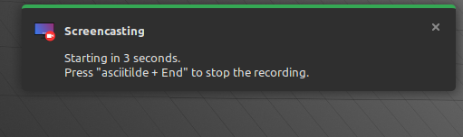
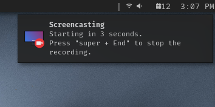
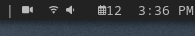

# FFmcast
---
**Allows users to create screencasts with FFmpeg triggered via sxkhd.**

## Intented Usage
This program is targeted towards users that only use a window manager instead of a full blown desktop environment, although the program still works for machines that have full DEs. This program is not intented to be ran on the terminal but instead by a hotkey program, in this case sxhkd.
There are 2 scripts that come with this program. One that starts the screencast `ffmcast-start` and one that ends the screencast `ffmcast-end`.
The program will give notifications to the user via dunst based on events that the program is doing.

There is also a script for users that use the Dynamic Window Manager with Slstatus that creates a "systray" icon to let users know that there is currently a screencast running in the background `sls-screencast`.

## Dependencies
- **FFmpeg**
- **Sxhkd**
- **Dunst**
- **Pulseaudio**
- **X11**

## Demo
https://github.com/user-attachments/assets/070d9368-8645-4ebc-8a25-14502fc739b9

## Todo
[ ] **Create an install script along side this project.**
This install script would automatically configure this program to work straight up out of the box. The script would be interactive and would do things like...
- Create a directory for screencasts to be saved in.
- Install all the dependencies needed to run this program properly.
- Move all the items from the `ffmcast/asset/` folder to the directories that the script needs to render notifications with sound and icons.
- Configure `~/.config/sxhkd/sxhkdrc` to have the hotkeys binded to run `ffmcast-start` and `ffmcast-end`.
- Have the user interactively change the variables in the script that define its behavior.

[ ] **Create some options for `ffmcast-start` that extend functionality.**
Some ideas that I have in mind are..
- No bell sounds on spawned dunst notifications.
- Video only for screencasts. (No audio)
- Capture only audio in a FFmcast recording.
- Specify screen resolutions for screencasts. (Right now the screencasts resolution is fixed to 1920x1080)
- Capture different monitors or capture many monitors at once. (In a multi-monitor setup)

[ ] **Give some indicator to the user that the screen is currently being recorded.**
I do have the `sls-screencast` script, but that only works for users that have slstatus installed. I would like to have a desktop environment agnostic way for users to know that the program is currently working. Something a like systray icon or perhaps an occasional dunst notification that occurs after an X amount of time on a loop.  
